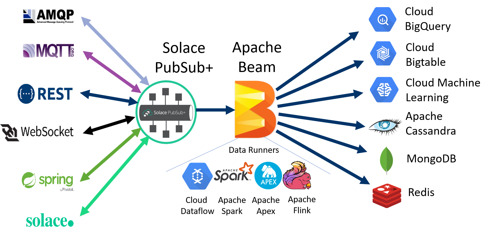
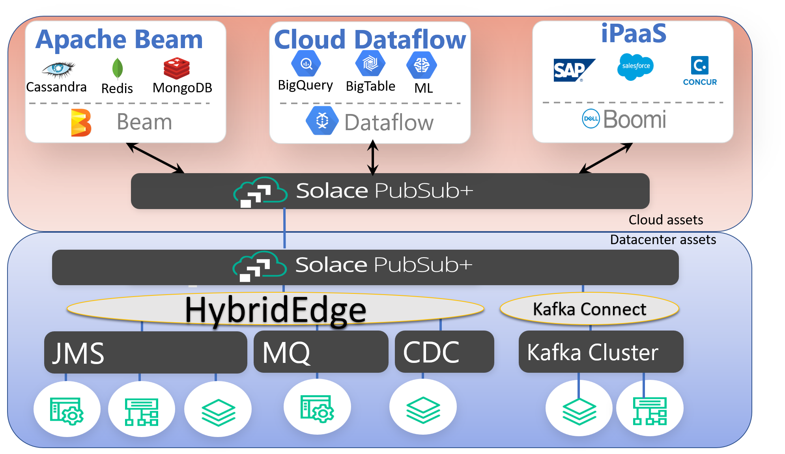

[](https://travis-ci.org/SolaceLabs/solace-beam-unboundedSource)

# solace-beam-unboundedSource

## Synopsis

This repository provides a solution which allows applications connected to a Solace Event Mesh to interop with Apache Beam SDK and it's as a service offering Google Cloud Dataflow.

Consider the following diagram:



It does not matter if the application communicates with the Solace PubSub+ broker (Appliances, Software and SolaceCloud) via a REST POST or AMQP, JMS or MQTT message, it can be sent streaming to Apache Beam for further processing by it's data runners and further on to other IO connectors such as BigQuery or Apache Cassandra, etc.

The Solace Event Mesh is a clustered group of Solace PubSub+ Brokers that transparently, in real-time, route data events to any Service that is part of the Event Mesh.  Solace PubSub+ Brokers are connected to each other as a multi-connected mesh that to individual services (consumers or producers of data events) appears to be a single Event Broker. Event messages are seamlessly transported within the entire Solace Event Mesh regardless of where the event is created and where the process exists that has registered interested in consuming the event. You can read move about the advantages of a Solace event mesh [here.](https://cloud.solace.com/learn/group_howto/ght_event_mesh.html)

Simply by having a Beam connected Solace PubSub+ broker added to the Event Mesh, the entire Event Mesh becomes aware of the data registration request and will know how to securely route the appropriate events to and from Beam Connected services.

To understand the Beam architecture of source and sink IO connectors and runners please review [Beam Documentation.](https://beam.apache.org/documentation/)

To understand the capabilities of different Beam runners please review the [runner compatibility matrix.](https://beam.apache.org/documentation/runners/capability-matrix/) 

This Beam integration solution allows any event from any service in the Solace Event Mesh [to be captured in:](https://beam.apache.org/documentation/io/built-in/)
* Google BigQuery
* Google Cloud Bigtable
* Google Cloud Datastore
* Google Cloud Spanner
* Apache Cassandra
* Apache Hadoop InputFormat
* Apache HBase
* Apache Hive (HCatalog)
* Apache Kudu
* Apache Solr
* Elasticsearch (v2.x, v5.x, v6.x)
* JDBC
* MongoDB
* Redis
* Amazon Kinesis
* File
* Avro Format

It does not matter which service in the Event Mesh created the event, the events are all potentially available to Beam Connected services. There is no longer a requirement to code end applications to reach individual data services.



## Design

The SolaceIO connector is an UnboundedSource connector providing an infinite data stream.  The connector will connect to a single Solace PubSub+ message broker, bind to and read from a list of [Solace Queues](https://docs.solace.com/Features/Endpoints.htm#Queues).  Each queue binding is a slice for the runner and can be read in parallel.  Messages can be acknowledged and deleted from Solace as they are read, (automatic), or in batches as each checkpoint is committed(client).  For information on these different acknowledgement modes, refer to [Solace Acknowledgments.](https://docs.solace.com/Solace-PubSub-Messaging-APIs/Developer-Guide/Acknowledging-Messages.htm
) 

## Usage

### Defining the Solace PCollection
To instantiate a SolaceIO connector a PCollection must be created within the context of a pipeline.  Beam programming-guide explains this [concept.](https://beam.apache.org/documentation/programming-guide/)

```java
  Pipeline pipeline = Pipeline.create(PipelineOptions options);
  PCollection<SolaceTextRecord> input =
    pipeline
      .apply(SolaceIO.<SolaceTextRecord>readMessage()
        .withConnectionConfiguration(SolaceIO.ConnectionConfiguration.create(String host, List<String> queues)
        .withUsername(String username)
        .withPassword(String password)
        .withVpn(String vpn)
        .withAutoAck(boolean autoAck)
        .withSenderTimestamp(boolean useSenderTs))
        .withSenderMessageId(boolean useSenderMi))     
        .withTimeout(int timeoutInMillis)
        .withCoder(SolaceTextRecord.getCoder())
        .withMessageMapper(SolaceTextRecord.getMapper())
      );
```

| Parameter       | Default          | Description  |
|-----------------|------------------|--------------|
| host            | _Requires input_ | Solace message broker uri in the form tcp://[ip or dns]:port|
| queues          | _Requires input_ | List of queue names, must be pre-configured|
| username        | _Requires input_ | Username used to connect to Solace message broker|
| password        | _Requires input_ | Password used to connect to Solace message broker|
| vpn             | default          | Logical VPN instance within the broker to connect to|
| autoAck         | false            | Acknowledge on receipt or after processing.  autoAck=true is 30-50% faster in tests but can cause message loss in cases where UnbundedSolaceReader needs to
re-establish connection to Solace such as auto-scaling event or network outages|
| SenderTimestamp | false            | Use Sender TS to deturmine freshness of data, else Beam receive time |
| SenderMessageId | false            | Use Sender Sequence Number else JCSMP autogenerated messageId |
| timeoutInMillis | 100              | Time between checkpoints|

## Getting more accurate latency and backlog.

By default the latency measurement is taken from the time the message enters Dataflow and does not take into account the time sitting in a Solace queue waiting to be processed.  If messages are published with sender timestamps and senderTimestamp is enabled in the SolaceIO, then end to end latencies will be used and reported.   For java clients the jcsmp property GENERATE_SEND_TIMESTAMPS will ensure each message is sent with a timestamp.

For the purposes of de-duplication messages the Solace Java SDK message Id is used by default.  This Id resets on reconnections and might not always be the best  for duplicate detection.  If a message is published with an application messageId and senderMessageId is enabled in the SolaceIO, then this value will be used to detect duplicates. For java clients the jcsmp property GENERATE_SEQUENCE_NUMBERS will ensure each message is sent with an application message Id.


To detect the amount of backlog that exists on a queue the Beam SolaceIO is consuming from, it sends a SEMP over the message bus request to the broker.  SEMP over the message bus show commands needs to be enabled as per these instructions: https://docs.solace.com/SEMP/Using-Legacy-SEMP.htm#Configur


## Test Walkthrough

This repository is accompanied by a travis test. Walking through the important lines of this test as well as the example code included in this repo, will help exemplify the SolaceIO usage.  In this walkthrough Solace Cloud is used to provide a Solace PubSub+ message broker in a standard CI integrated test fassion.  Look [here](https://cloud.solace.com/) to see more info about Solace Cloud.

Create a new Solace PubSub+ message broker as a service in Google Cloud:
```yaml
  - newBroker=`curl --request POST --url "https://console.solace.cloud/api/v0/services"  -H "Authorization:Bearer ${SOLACE_CLOUD_TOKEN}"  --header "Content-Type:application/json" --data @data.json`
```

Extract the connection information from the new broker service:
```yaml
- serviceInfo=`curl -H "Authorization:Bearer ${SOLACE_CLOUD_TOKEN}" --url "https://console.solace.cloud/api/v0/services/${serviceId}"`
```

Create a test queue on the new message broker service:
```yaml
  - curl -X POST -H "content-type:application/json" -u ${MGMT_USERNAME}:${MGMT_PASSWORD} ${MGMT_URI}/msgVpns/${SOLACE_VPN}/queues -d '{"queueName":"Q/fx-001","egressEnabled":true,"ingressEnabled":true,"permission":"delete"}'
```

Test the new message broker is reachable and functioning:
```yaml
   - pubSubTools/sdkperf_c -cip=${SOLACE_URI} -cu="${USERNAME}@${SOLACE_VPN}" -cp=${PASSWORD} -mt=persistent -mn=100 -mr=10 -msa=10 -pql=Q/fx-001 -sql=Q/fx-001 | grep "Total Messages"
```

Load 100 10-byte test messages onto the new message broker:
```yaml
  - pubSubTools/sdkperf_c -cip=${SOLACE_URI} -cu="${USERNAME}@${SOLACE_VPN}" -cp=${PASSWORD} -mt=persistent -mn=100 -mr=100 -msa=10 -pql=Q/fx-001  -epl "jcsmp.GENERATE_SEND_TIMESTAMPS,true,jcsmp.GENERATE_SEQUENCE_NUMBERS,true"
```

Bring up a SolaceIO example on a local runner to consume the messages:
```yaml
 - mvn -e compile exec:java -Dexec.mainClass=com.solace.apache.beam.examples.SolaceRecordTest -Dexec.args="--output=DR100A --cip=${SOLACE_URI} --cu=${USERNAME}@${SOLACE_VPN} --cp=${PASSWORD} --sql=Q/fx-001" > /dev/null 2> output.log &
```

 Validate the messages where received and acknowledged:
```yaml
  - grep -E "UnboundedSolaceReader - try to ack [0-9]+ messages with active Session" output.log
```

### Contributing

Please read [CONTRIBUTING.md](CONTRIBUTING.md) for details on our code of conduct, and the process for submitting pull requests to us.

## Authors

See the list of [contributors](../../graphs/contributors) who participated in this project.

## License

This project is licensed under the Apache License, Version 2.0. - See the [LICENSE](LICENSE) file for details.

## Resources

For more information about Solace technology in general please visit these resources:

- The [Solace Developers website](https://www.solace.dev/)
- Understanding [Solace technology]( https://solace.com/products/tech/)
- Ask the [Solace Community]( https://solace.community/)
